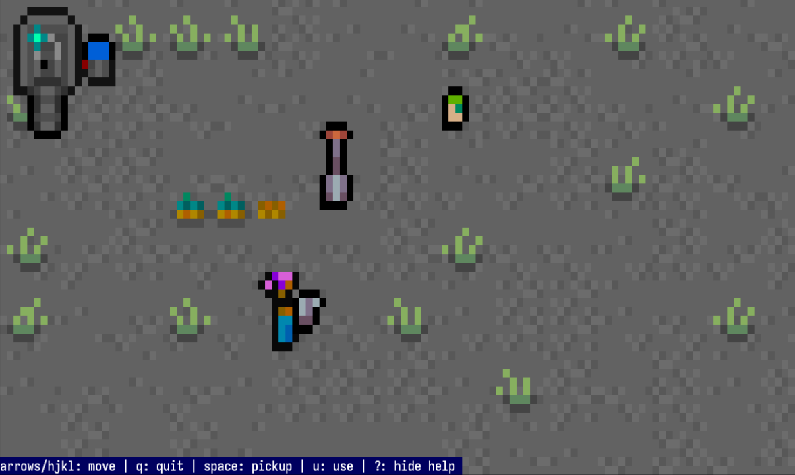

# queer folk farmpunk: farming on the moon

#### Status

Tested and works on common Linux, Mac, and Windows terminal emulators. Written within WSL.

Known issues:
- On Windows Powershell, key repeats spam the input event queue. So if you hold down a key to move, your character will keep moving after key release. Nonetheless, the game should be playable with delicate inputs.

#### Running

You will need the [Rust compiler and package manager](https://doc.rust-lang.org/cargo/getting-started/installation.html), `cargo`.

`cargo run` - debug information will be displayed.
`cargo run -r` - run the release version.

Your terminal font must support unicode half-block characters ('▀', '▄') and 256 colors.

### What is it?

A tech demo that plays out as a demake of popular farming games.

`qffp` demonstrates the possibility of creating animated pixel art games that run in a terminal. This implementation is written in Rust and makes primary use of three crates: [crossterm](https://github.com/crossterm-rs/crossterm) for terminal input and low-level windowing, [specs](https://github.com/amethyst/specs) for a versatile entity component system, and [anathema::display](https://github.com/togglebyte/anathema) for flicker-free, double-buffered rendering.

One interesting quality of a pixel buffer being used in a terminal is that the text is inherently higher resolution than the graphics, creating cozy yet readable output.

### Lessons

qffp is my first finished game prototype in the Rust language. I learned a lot about the language while using it and did not encounter anything too difficult. Alongside gaining Rust experience, I became more familiar with specs, the ECS crate I used. The strength of its design became apparent when rendering sorted, animated text sprites in an earlier prototype. So far I've kept the code in a prototype state (delicate, unoptimized) as my goal was mainly to prove the concept of an animated terminal game.

#### Things I would do differently

I implemented sprite rendering early on and did not create an intermediary buffer upon which to render pixels before copying to the terminal using Unicode half-block characters. This means when rendering transparent pixels I need to perform logic on the existing text buffer, which is limited by the fact that the Y axis counts by 2 - because each character cell is two pixels stacked vertically.

The renderer would be more flexible if everything was rendered to an internal pixel buffer first. It technically is double buffered with the display module, but that's another text buffer, not a pixel buffer. All this results in game logic needing to count the y axis of sprites by 2, which is not ideal.

### Features/to-do

- [x] custom animated pixel art
- [x] image sprite loading and rendering
- [x] input state passable to specs systems
- [x] "depth" sorting of sprites
- [x] animated particle sprites
- [x] entities have unique ids
- [x] dig with shovel: grass or crop near, uproot. nothing near, place empty crop
- [x] seed packet: empty crop near, change empty crop to leaf crop
- [x] watercan: crop near, make watered; watered crops grow when sleeping
- [x] pod: use to sleep
- [x] transition animation on sleep
- [x] terminal: displays sequence of messages to progress story between sleep cycles
- [x] make it gay

### Post-release fixes and features

- [x] terminal is no longer accidentally usable from any distance
- [x] story text now explains sleeping as a mechanic
- [x] grass near the top of the screen can now be destroyed
- [x] empty tilled soil that gets watered now produces animated grass
- [x] cleaner handling when resizing the terminal (issues clear/redraw)
- [x] the anonymous computer voice is now more kind

#### License

The code is released under the MIT license. The art assets are released under [CC-BY-SA-4.0](https://creativecommons.org/licenses/by-sa/4.0/).
